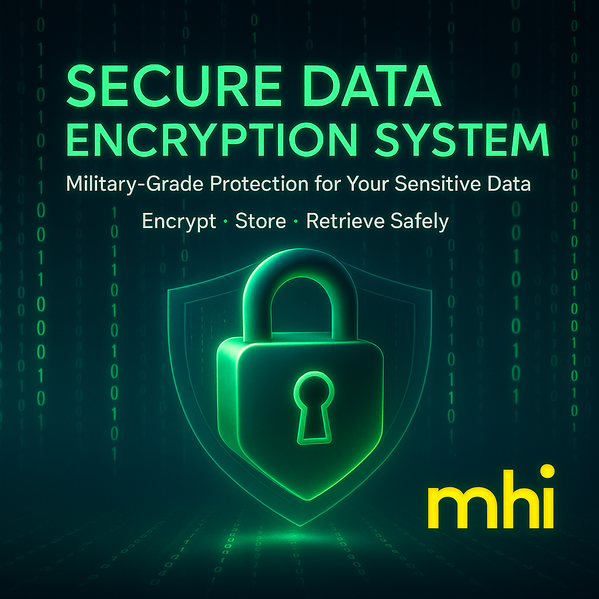

# 🔐 Secure Data Encryption System



A Streamlit-based web application that provides secure encryption and storage of sensitive data with passkey protection.

## 🌟 Key Features

| Feature | Description |
|---------|-------------|
| 🔒 Military-Grade Encryption | Uses Fernet (AES-128) cryptography |
| 🔑 Passkey Protection | Data only decrypts with correct passkey |
| 🛡️ Brute Force Protection | Locks after 3 failed attempts |
| 💾 In-Memory Storage | No database required |
| ✨ Intuitive UI | Clean, user-friendly interface |
| ⏱ Session Management | Tracks active sessions |

## 🚀 Getting Started

### Prerequisites
- Python 3.8 or higher
- pip package manager

### Installation
1. Clone the repository:
```bash
git clone https://github.com/muhammadHamzaIsmaeel/Secure-Data-Encryption-System.git