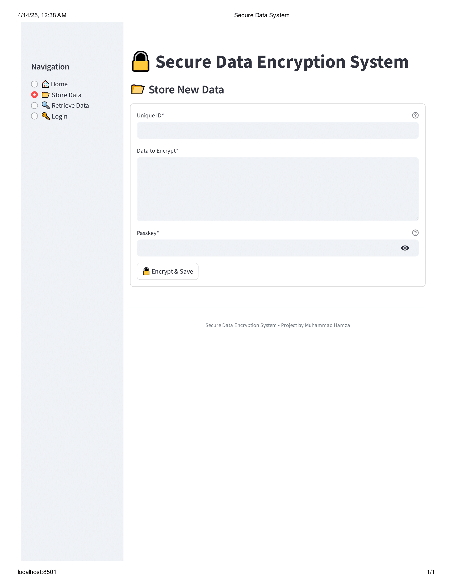

# 🔐 Secure Data Encryption System

[](https://opensource.org/licenses/MIT)


A Streamlit-based web application that provides secure encryption and storage of sensitive data with passkey protection.

## 🌟 Key Features

| Feature | Description |
|---------|-------------|
| 🔒 Military-Grade Encryption | Uses Fernet (AES-128) cryptography |
| 🔑 Passkey Protection | Data only decrypts with correct passkey |
| 🛡️ Brute Force Protection | Locks after 3 failed attempts |
| 💾 In-Memory Storage | No database required |
| ✨ Intuitive UI | Clean, user-friendly interface |
| ⏱ Session Management | Tracks active sessions |

## 🚀 Getting Started

### Prerequisites
- Python 3.8 or higher
- pip package manager

### Installation
1. Clone the repository:
bash
git clone https://github.com/muhammadHamzaIsmaeel/Secure-Data-Encryption-System.git

## 🖥️ How to Use

### 🔐 Storing Encrypted Data
1. Click "Store Data" in sidebar  
2. Enter:
   - Unique identifier for your data
   - The sensitive information to encrypt
   - A strong passkey (remember this!)
3. Click "Encrypt & Save"

### 🔓 Retrieving Data
1. Click "Retrieve Data" in sidebar  
2. Provide:
   - The same unique identifier
   - The exact same passkey  
3. Click "Decrypt"

### ⚠️ Account Lockout
After 3 failed decryption attempts:
1. System will lock  
2. Go to "Login" page  
3. Enter master password to unlock  

## ⚙️ Configuration

| Setting | Default | Description |
|---------|---------|-------------|
| `MASTER_PASSWORD` | `admin123` | **Change this** before production use |
| `MAX_ATTEMPTS` | 3 | Failed attempts before lockout |
| `FERNET_KEY` | Auto-generated | Encryption key (stored in session) |


## 📸 Screenshots

| Store Data Page | Retrieve Data Page |
|-----------------|-------------------|
|  |  |

📜 License
This project is licensed under the MIT License - see the LICENSE file for details.

## 📧 Contact

For questions or support:

- 👤 **Muhammad Hamza**  
- 📧 [m.hamzashaikh6067@gmail.com.com](m.hamzashaikh6067@gmail.com)  
- 💻 [GitHub Profile](https://github.com/muhammadHamzaIsmaeel)  

<div align="center"> <p>Made with ❤️ using Python and Streamlit</p>   </div> ```

   
   
   
